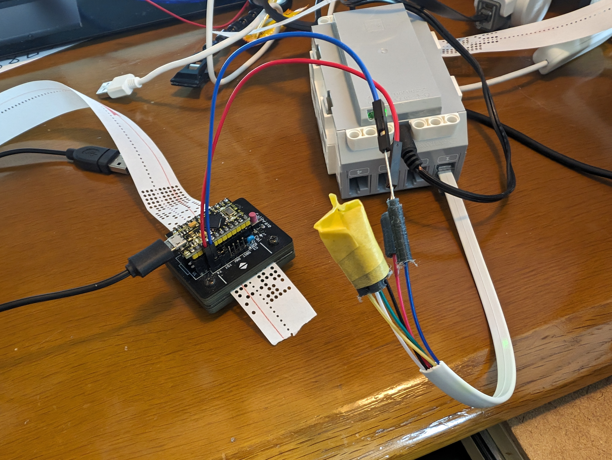

# EV3のMicropython開発環境とシリアル通信について

いろいろ試してみて、EV3にMicropythonが実行できるOSの入ったSDCARDを用意し、
クロスケーブルで他デバイスと接続するのが簡単なやり方だと分かった。

開発環境は以下の手順で導入する。

1. EV3のOSを切り替えるSDCARDを用意
2. VS CodeにEV3用Micropython開発環境を導入
3. 他デバイス接続用クロスケーブルを作る
4. Micropythonでコーディングし、EV3で実行

## EV3の環境設定

以下の手順で行う

1. 公式ページからMicropythonの使えるEV3のSDCARDイメージをダウンロードする。

https://assets.education.lego.com/v3/assets/blt293eea581807678a/blt9df409c9a182ab9c/5f88191a6ffd1b42dc42b8af/ev3micropythonv200sdcardimage.zip?locale=en-us

2. 上記データをEtherというツールでSDCARDに焼く。
3. EV3のサイドスロットに焼いたSDCARDを挿入して電源を入れる。SDCARDから起動してMicropythonが使えるようになる。

### 参考: Getting started with LEGO® MINDSTORMS Education EV3 MicroPython # Installation
https://pybricks.com/ev3-micropython/startinstall.html

### 参考: LEGO educationページにはVS Codeの導入も含めた動画の説明がある
https://education.lego.com/en-us/product-resources/mindstorms-ev3/teacher-resources/python-for-ev3/

## VS CodeにEV3開発環境を導入

VS Codeの左端、拡張追加ボタンをクリックして、「LEGO EV3 MicroPython」などで検索し、LEGO® MINDSTORMS® Education EV3を導入する。

### 参考: Micropython Creating and running programs (VS Code開発環境の使い方)
https://pybricks.com/ev3-micropython/startrun.html

## クロスケーブル作成

1. LEGO純正EV3接続ケーブルか、6芯モジュラーケーブルをぶった斬る。6芯モジュラーケーブルはそのままではLEGOに刺さらないので、爪のでっぱりを削り取る。

2. 以下のように接続する。

LEGO接続ケーブル結線図 ソケットから見て右端が1番。6芯モジュラーケーブルは以下のように色分けされている。

|番号|色|用途|
|--|--|--|
|1|白|9V (Analog) 供給|
|2|黒|GND (Analog)|
|3|赤|GND|
|4|緑|4.3V 供給|
|5|黄|I2C Clock(SCL)/RS485-B(TXD)|
|6|青|I2C Data(SDA)/RS485-A(RXD)

PCと接続するとき

|PC用USBシリアル変換アダプタ|EV3ケーブル|
|--|--|
|GND|3 赤(GND)|
|RX|5 黄(TX)|
|TX|6 青(RX)|

紙テープリーダーと接続するとき

|紙テープリーダー|EV3ケーブル|
|--|--|
|TX|6(RX)|
|GND|3 赤(GND)|

### 参考: EV3シリアルコンソールを起動してみた @koushiro(Koushiro A)
https://qiita.com/koushiro/items/772dca79b25ed4e5bfbe

## Micropythonでのシリアル通信のやり方

このリボジトリの以下ディレクトリにサンプルプロジェクトがある。

VS CodeのEV3拡張機能は、プロジェクトにあるファイルを全部EV3にコピーしてからmain.pyを起動するので、
以下のプロジェクトを試すときは、対象ディレクトリをルートにして、新たにVS Codeを立ち上げてから実行すること。

|プロジェクト|内容|
|--|--|
|[comtest](./comtest/)|PCにターミナルで接続し、PCから送信された文字列を行ごとに音声出力する|
|[tapereader](./tapereader/)|紙テープリーダと接続し、なんかする|

### 参考: Micropythonマニュアルと公式サンプルコード
https://pybricks.com/ev3-micropython/iodevices.html#uart-device
