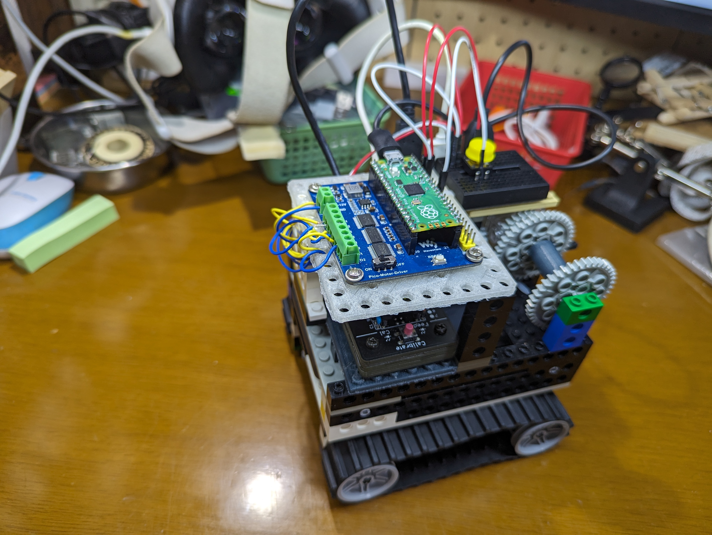
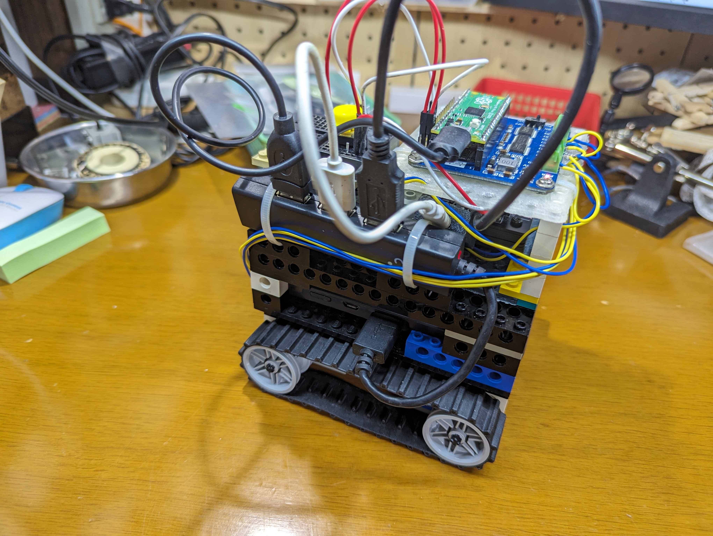
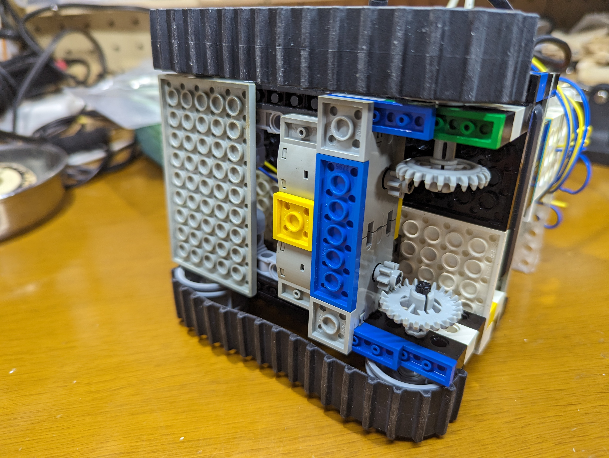
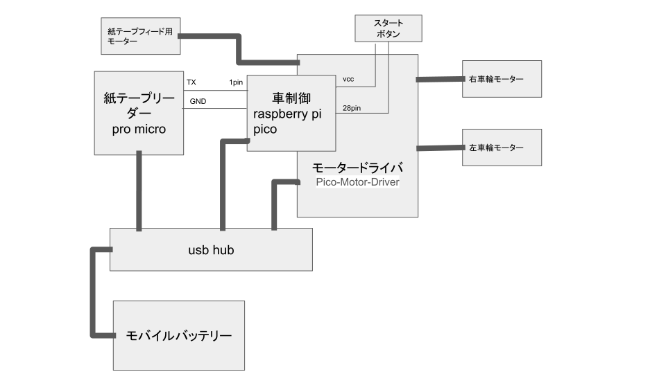

# PaperTapeReaderCar

紙テープを読んでそこに書いてある指令通りに走る車

裏側

底面

### 構成図

紙テープリーダーと全体制御のPicoとそれに付属したモータードライバーとモーター３個からなる。
モバイルバッテリーからUSBハブで紙テープリーダー、Pico、モータードライバーの３か所に電源を供給している。
紙テープリーダーのTX出力はPico側のUART0に通信ケーブルで接続されている。RXはつないでないので
紙テープリーダーが一方的にテープ読み出し用光センサーの値を送ってくるだけである。

電源ONと同時に紙テープリーダーが通信を開始し、遅れてPico側が通信ポートをオープンすると、
かなりの頻度で同期がズレて文字化けを起こすので、文字化けすると再オープンする処理が入っている。

紙テープリーダーは以下のもの。テストモードの出力がTXから送信されるようにソフトウェアに若干手が入っている。

https://www.e-basteln.de/computing/papertape/building/

picoモータードライバーの資料

https://www.waveshare.com/wiki/Pico-Motor-Driver

ソース一覧

||ファイル名|
|--|--|
|picoソース|main.py|
|紙テープリーダー修正ソース|sketch_oct4a.ino|
